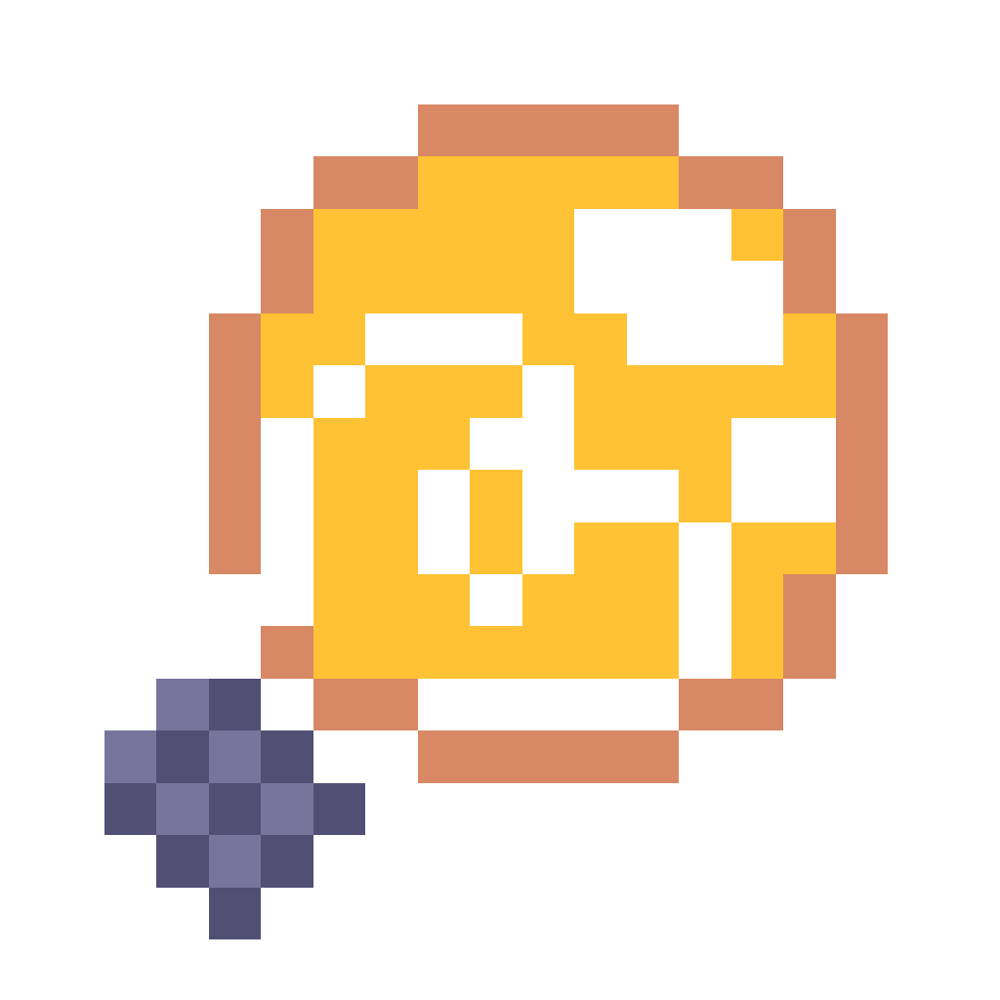

# 🎵 World Machine Player

*Jukebox from OneShot World Machine Edition recreated in Godot*

---

## ✨ About

World Machine Player is a fan-made recreation of the Jukebox application from OneShot: World Machine Edition.
## 🌟 Features

### 🎶 **Music Playback**
- **Multi-format Support**: Plays `.ogg`, `.mp3`, `.flac`, and `.opus` audio files
- **Track Navigation**: Next/Previous track controls
- **Playback Controls**: Play, Pause, Stop, and Restart functionality

### 🎚️ **Audio Controls**
- **Volume Control**: Precise volume adjustment
- **Speed Control**: Playback speed adjustment from 50-150% 
- **Loop Playback**: Automatic track looping

### 🎨 **Customization**
- **Themes**: Multiple visual themes to customize the player's appearance and match your mood  

### ⚙️ **Settings**
- **Custom Music Folder**: Set your own music directory
- **Settings Persistence**: All preferences saved automatically

## 📥 Installation

### Prerequisites
- **Godot 4.5** or later (for development)
- **Windows**

### Quick Start
1. **Download** the latest release from the releases section
2. **Run** `WorldMachinePlayer.exe`
3. **Add Music**: Place your `.ogg`, `.mp3`, `.flac`, or `.opus` files in the music folder
4. **Enjoy!** 🎵

### Adding Music
1. Click the **Settings** button (OneShot icon in left corner)
2. Set your **Music Folder Path**
3. Add your audio files to that folder
4. The app will automatically scan and load your music!

## 🎨 Screenshots

## 📜 License

This project is a **fan-made recreation** based on OneShot: World Machine Edition.

**Original Rights**: All rights to OneShot characters, music, and assets belong to **Team OneShot** and **Future Cat LLC**.

**Fan Content**: This project is created by fan for fans, with no commercial intent.

---

*"You only have one shot"*

**Made with ❤️ for the OneShot community**

